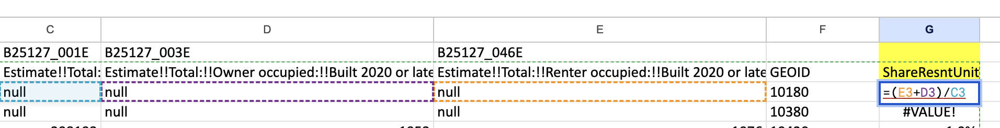

# RE 397 Lab Section A

 

:max_bytes(150000):strip_icc():format(webp)/real-estate-what-it-is-and-how-it-works-3305882-1f1ca22206274467862367e2dc59f25b.png)

## Introduction

About myself.

[Welcome to connect me on Linkedin](https://www.linkedin.com/in/zhongmin-luo-9b5400221/)

## Announcement
1. Grading policy
2. According to Canvas schedule this Lab session takes up 110 minutes, but it usually finishes up within 90 minutes.
3. I will set up a regular office hour on Friday between 2:00pm - 3:00 pm via [Zoom](https://washington.zoom.us/j/95676546990) to answer lab questions.
4. Lab will be recorded and you will find recording link on this webpage later!!

## Discussion: Why Data Modeling? 

## Lab 1
*January 14, 2025*
### Organize dataset
1. Assignment folder
### Download dataset
1. Net migration share
> Go to [Census annual net migration data and population estimates](https://www.census.gov/data/tables/time-series/demo/popest/2020s-total-metro-and-micro-statistical-areas.html)
Find **cbsa-est2023-alldata**
2. Population change rate
> same step as net migration share
3. Share of recent constructed residential
> select the table **Table B25127** then the year of 2023, then under “Geographies” -> “Metropolitan/Micropolitan Statistical Area” -> all metropolitan statistical areas in the US and PR

### A Few Reminders 
1. **When you are downloading dataset from the Census website, you should click `ZIP` because using the zip option, the data format will come the way we need for this project. You do not need to remove the MOE or Transpose before downloading, although doing so will not have any issue for the final results.**
2. “OCC_Tittle” in the section of "Employment" is just a column name in the dataset. You do not need to worry about that for Lab1. This is for Thursday or next week’s lab.
3. we use `2020 5-year estimate` which is inconsistent with `2023 1-year estimate` because of COVID, the survey response was extremely low and `margin of error` was too high in many places to generate reliable/meaningful estimates, that is why Census only published `5-year estimates` for 2020.

## Lab 2
*January 21, 2025*
### Questions for Practice 4 (30mins)
### Assignment 1 continue
1. Share of recent constructed residential units
* First, you should find these three variables **`Estimate!!Total:`	`Estimate!!Total:!!Owner occupied:!!Built 2020 or later:`	`Estimate!!Total:!!Renter occupied:!!Built 2020 or later:`** from `B25127` you downloaded from ACS website.

* Second, Create 5-digit MSA ID based on GEOID from the Census ACS downloads. Use Excel formula “=right([CELL], 5)” to extract the last 5 digit of each GEOID. You will need to use this as the common field to join other datasets. After converting, a best practice is to copy and paste value in the same column, and convert text to number
* calculate Share of recent constructed residential unites using the formula:
> (“Owner occupied:!!Built 2020 or later:” + “Renter occupied:!!Built 2020 or later:”) / “Total:”
Your calculation should be like 

2. Price Rent Ratio
* remember you should have two different dataset downloaded from ACS website. 
* copy and paste `Estimate!!Median value (dollars)`	`Estimate!!Median gross rent` data **separately** on your sheet
* For each data table, create numeric `GEOID` as we do in the second step in Share of recent residential unit above.
* create another next to your Median Value column called Median Gross Rent.
* Use VLOOKUP function to join the Median Gross Rent data to Median Value data. Below is the detail of VLOOKUP function in excel. You can also look at this [video](https://www.youtube.com/watch?v=xIynD1gFOLo).
* Finally calcuate Price rent ratio using the formula:
>“Median value (dollars)” / (“Median gross rent” * 12)
** Be care of bracketing median gross rent multiplied by 12**
Your result should look like 

**VLOOKUP=(lookup_value, table_array, col_index_num, [range_lookup])**
1. lookup_value
The value you want to search for in the first column of the table_array.
2. table_array
The range of cells (e.g., *A1:D10*) containing the data. The first column of this range is where lookup_value will be searched.
3. col_index_num
The column number (starting from 1 for the first column of table_array) from which the value will be returned.
4. [range_lookup] (Optional)
A logical value that specifies whether you want an exact match or an approximate match:
TRUE (or omitted): Finds the closest match that is less than or equal to the lookup_value. The first column must be sorted in ascending order.
FALSE: Finds an exact match. If no exact match is found, the function returns #N/A.
