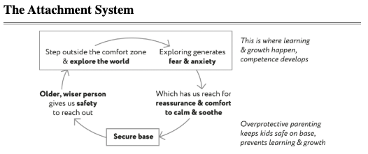

# RE 397 Lab Section A

 

:max_bytes(150000):strip_icc():format(webp)/real-estate-what-it-is-and-how-it-works-3305882-1f1ca22206274467862367e2dc59f25b.png)

## Introduction

About myself.

[Welcome to connect me on Linkedin](https://www.linkedin.com/in/zhongmin-luo-9b5400221/)

## Announcement
1. Grading policy
2. According to Canvas schedule this Lab session takes up 110 minutes, but it usually finishes up within 90 minutes.
3. I will set up a regular office hour on Friday between 2:00pm - 3:00 pm via [Zoom](https://washington.zoom.us/j/95676546990) to answer lab questions.
4. Lab will be recorded and you will find recording link on this webpage later!!

## Discussion: Why Data Modeling? 

## Lab 1
*January 14, 2025*
### Net migration share
1. Go to [Census annual net migration data and population estimates](https://www.census.gov/data/tables/time-series/demo/popest/2020s-total-metro-and-micro-statistical-areas.html)
2. Find **cbsa-est2023-alldata**
3. Sort by **POPESTIMATE2023** high to low, then select **Metropolitan Statistical Area** under column "LSAD"
4. Select top 100 (101 records) and copy-and-paste three fields
5. It is your first sheet and should look at 
6. 
